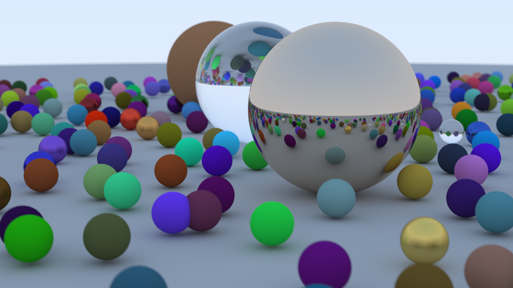
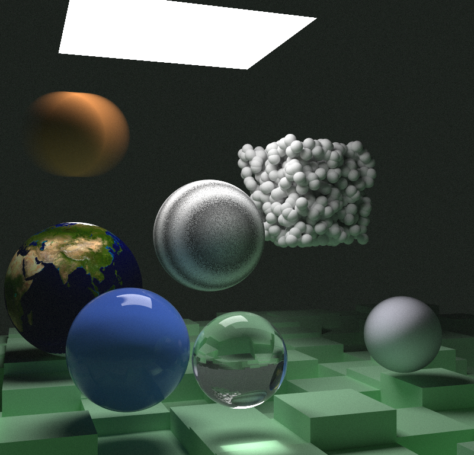
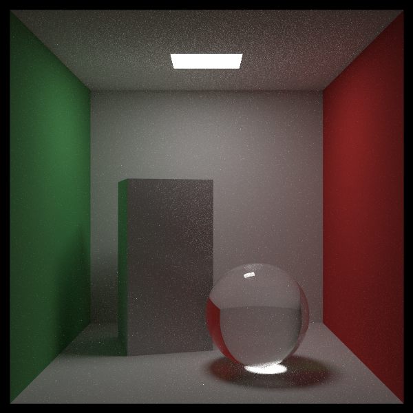

光线追踪渲染器  
渲染图片位于 images 文件夹中

# in one weekend

## 实现效果

- PPM file format
- antialiasing using multisampling
- material
  - diffuse material
  - lambertian reflection
  - metal
  - dielectrics
- basic camera model supporting moving\defocus blur
- procedural-generating sphere scene

## final render

# nextWeek

## 实现效果

- motion blur
- BVH using AABBs
- texture mapping

  - checker
  - image texture
  - solid color
  - perlin noise

  ## final render

  

  # restOfYourLife

  ## 实现效果

  - stratified sampling
  - importance sampling implementing pdfs for:
    - sphere
    - light(quad shape)
    - mixed pdf
    - pdf for hittable-list(mixing their pdf with same weight)
    ## final render
    
